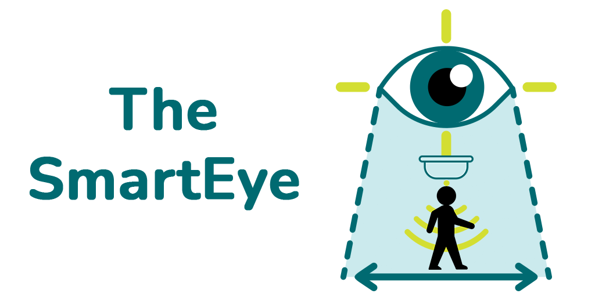

<p align="center">
  
</p><br />

# Site The SmartEye

- Site do projeto The SmartEye.

<br />

<p align="center">
  <a href="#features"> :newspaper: Features</a>&nbsp;&nbsp;|&nbsp;&nbsp;
  <a href="#requisitos">:pushpin: Pré-requisitos</a>&nbsp;&nbsp;|&nbsp;&nbsp;
  <a href="#tecnologias">:computer: Tecnologias</a>&nbsp;&nbsp;|&nbsp;&nbsp;
  <a href="#rodando"> :computer: Passo a Passo</a>
</p>

<br />

<div id="features" align="center">
    <h2> :newspaper: Features</h2>
</div>

- [x] Sobre;
- [x] Serviços:
  - [x] Plataforma SmartEye;
  - [x] Monitoramento de Recursos;
  - [x] Visualização em Tempo Real.
- [x] Equipe;
- [x] Contatos:
  - [x] Email;
  - [x] Facebook;
  - [x] Instagram;
  - [x] Linkedin;
  - [x] Whatsapp.

<br />

<div id="requisitos" align="center">
    <h2> :pushpin: Pré-requisitos</h2>
</div>

- [Git](https://git-scm.com)
- [NodeJs](https://nodejs.org/)
- [Npm](https://www.npmjs.com/) ou [Yarn](https://yarnpkg.com/)
- [ReactJs](https://reactjs.org/)
  - [TypeScript](https://www.typescriptlang.org/pt/)
- [VSCode](https://code.visualstudio.com/)

<br />

<div id="tecnologias" align="center">
    <h2> :computer: Tecnologias</h2>
</div>

<table class="table" align="center" style="text-align: center;">
  <thead>
    <tr>
      <th scope="col">Projeto</th>
      <th scope="col">Tecnologia Utilizada</th>
    </tr>
  </thead>
  <tbody>
    <tr>
      <th scope="row" rowspan="2">Web</th>
      <td>NodeJs</td>
    </tr>
    <tr><td>ReactJs</td></tr>
  </tbody>
</table>

<br />

<div id="rodando" align="center">
   <h2> :computer: Passo a Passo</h2>
</div>

```bash
Em Breve...
```

---

Desenvolvido por: :copyright: The Smart Eye :eye_speech_bubble:
